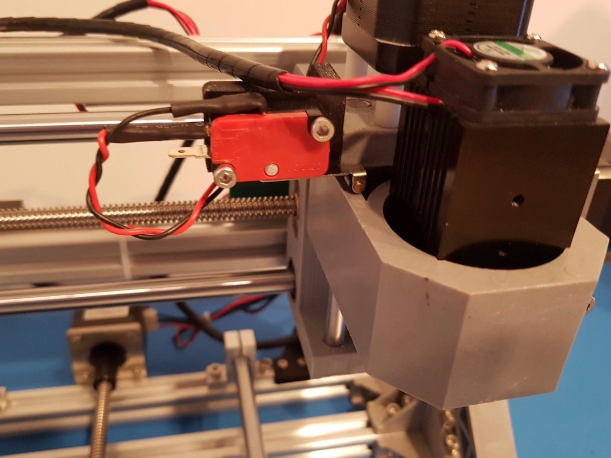
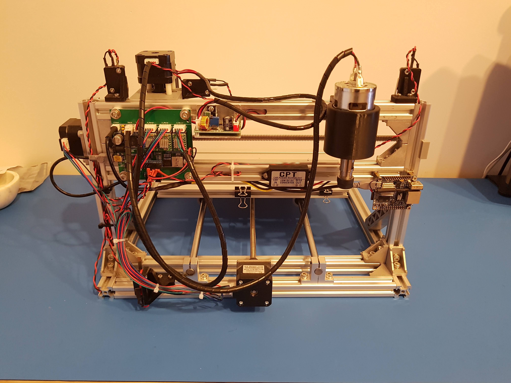

Here's how I added some limit/homing switches to my 3018 CNC machine.

### Parts Needed 
* 3D printed mounts - <small>*[Thingiverse](https://www.thingiverse.com/thing:2844871)*</small>
* Micro switches w/ long lever (V-153-1C25) - <small>*[AliExpress Affiliate](http://s.click.aliexpress.com/e/bIMThA4X)*</small>  
* Dupont connector kit - <small>*[Aliexpress Affiliate](http://s.click.aliexpress.com/e/bPuF2U16)*</small>
* Heat shrink tubing  
-- Optional --
* Micro switch w/ roller - <small>*[AliExpress Affiliate](http://s.click.aliexpress.com/e/c6Ri1ZIY)*</small>

### The (Short) Guide
I think that @Bracketracer's guide on [Thingiverse](https://www.thingiverse.com/thing:2844871) is very detailed and easy to follow. Instead of repeating it, I've decided to only include the parts I did differently and add a few extra pictures for detail. I should also note that I forgot to print out the mirrored versions of the mounts and decided to make due with my mistake.  

#### Z Home
I decided to mount roller-style switch for Z home on the C-shaped part of the z-axis instead of going directly on the tool clamp as shown in the guide. This way, I don't have to bend the lever arm or drill any holes into the tool clamp. The switch was first mounted in the printed part, then the assembly was super glued.

