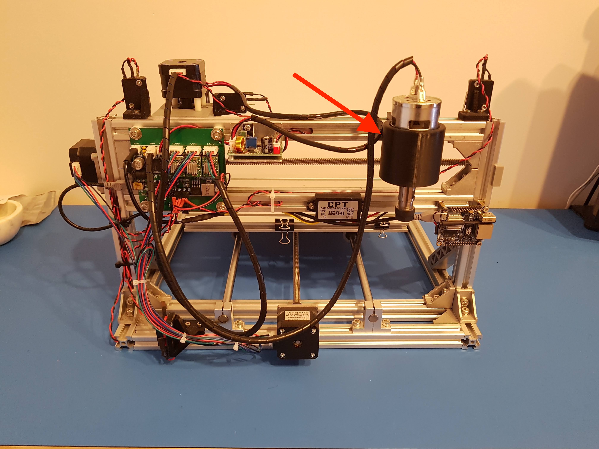

I made a little holder for the spindle/laser on my 3018 CNC. This way, when I'm using one I can keep the other on the machine and swap between them easily. If you want to print your own, the files are [available on Thingiverse](https://www.thingiverse.com/thing:3364954). 

 
