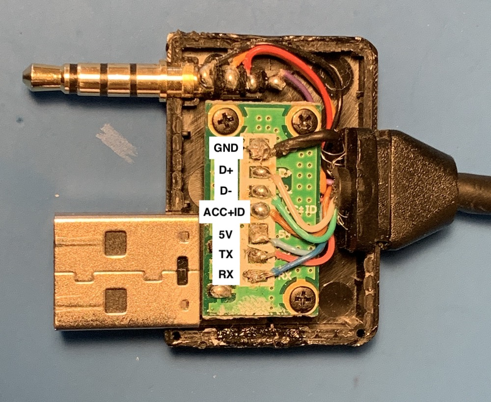
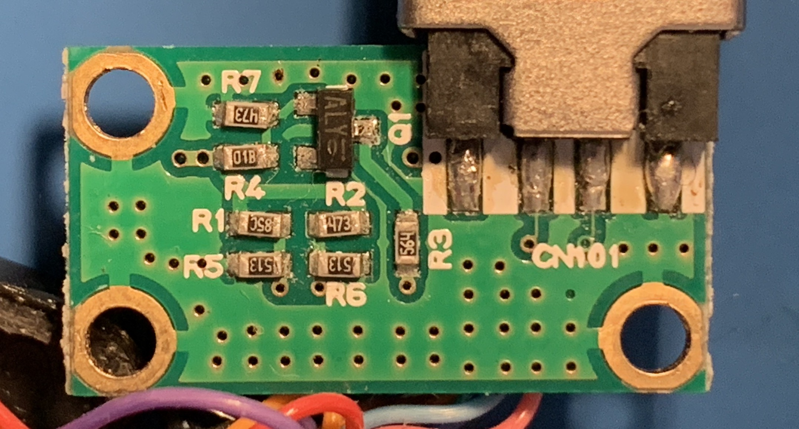

*This is the second part of a series on spoofing an iPod for car stereo shenanigans. You can [read part 1 here]().*

Before being able to spoof an iPod, my first step was to figure out how the car talks to a real one. I tried the simplest thing I could think of first, plug my iPhone directly into the car using the lightning cable. No dice. Next, I dug up an old iPod nano and plugged that in using a standard apple 30-pin cable. Still no luck. 

It's at this point that I realized that there must of been something special with Hyundai's cable. Not wanting to shell out $50 on a real one, I found a cheap knock-off on Aliexpress and tried that instead. After waiting about a month for the cable to arrive, I plugged it in and it still didn't work.

Time to try the real thing. As luck would have it, I found one on Kijiji for cheap. Unsurprisingly, the real one worked perfectly. I could see the current track info on the center console and change songs using the steering wheel. Progress!

Now that I know it works, it was time to tear it to bits. Here are pictures of the front and back of the PCB inside the cable. 

<small>PCB front, annotated with the hidden silkscreen.</small>

{:class="post-img"}
<small>PCB back, where the most of the magic happens :sparkles:.</small>

I could now start tracing out connections using the pictures and a multimeter set to continuity mode. Since most of the circuit is made up of simple resistors so I started with those first. 

Next, I focused on the mystery 3-pin device labeled Q1. Q1 tells me it's a transistor and by decoding the ALY markings on it, I could figure out exactly what transistor it is. Here's a pretty great post on StackExchange on [how to identify SMD components](https://electronics.stackexchange.com/questions/334128/how-do-i-identify-smd-components-or-how-do-i-identify-any-component). After the research, we can see it's a KTC3875S-Y NPN transistor. 

I also needed to understand what the various pins on the iPod connector do. This page from [LowEnd Mac](https://lowendmac.com/2016/apples-30-pin-dock-connector/) and this one from [AllPinouts](https://allpinouts.org/pinouts/connectors/portable_device/apple-ipod-ipad-and-iphone-dock/) were super helpful. 

With the circuit all sketched out, I took it to KiCad and made it all pretty. Those files or a PDF version is [available here](https://github.com/nadavami/Hyundai-iPod-Cable).

I could finally begin figuring out what the circuit actually does. 

Let's start with the USB connector, it's not actually sending USB signals! It's connected to the iPod's serial lines. That would explain why a regular iPod cable (or the knock-off) wouldn't work - those sent USB traffic when the car was expecting plain-old 19200 baud 8N1 serial. 

The next interesting bit is the ACC+ID line which tells the iPod what type of accessory it's connecting to. When the car is powered the transistor (Q1) acts as a closed switch (biased by R4 & R7), and puts R3 (560k resistor) between ACC+ID and ground. Referring back to the LowEnd Mac and AllPinouts pages tells us that a 500k resistor on ACC+ID enables serial communication and sets the iPod into "Dension Ice Link Plus" car interface mode. This makes sense considering what we figured out about the USB connector. 

Audio signals are simply sent straight through from the dock connector to the audio plug on the cable. I was pretty surprised to see the iPod's video out signal is passed though as well. My car has a monochrome graphic display so it's clearly not used. That said, the same cable is used on many Hyundai and Kia cars of the era so maybe it was on a different model :man_shrugging:.

Not particularly critical to my end-goal but still worth mentioning are the connections to D+ and D- on the dock connector. These are used to allow the iPod to charge from the power provided by the car and also to been seen as a valid (read: Apple authorized) accessory. Since there won't actually be an iPod, we can ignore them.

tl;dr - the iPod is communicating via serial on the USB port D+ & D- lines and analog audio is passed straight through. 

In the next post, we'll see how I can (hopefully) put all of that info to use and change the damn song using the steering wheel.  