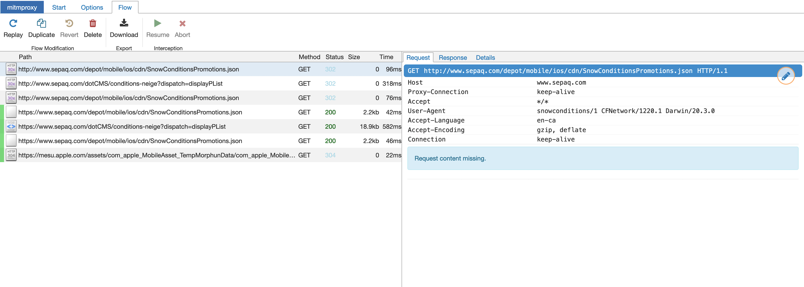

Recently, I wanted to see how an app on my phone was making API calls. 

The Montreal INFO-Neige app tracks the status of plowed streets around the city and I wanted to see if could use the data for a possible upcoming project. The API is actually [part of the city's Open Data project](https://donnees.montreal.ca/ville-de-montreal/deneigement), but you have to send an email to get an API key and I couldn't be bothered...

To inspect the traffic, I used [mitmproxy](https://mitmproxy.org). It's a really awesome tool that lets you inspect web traffic. The following was done on a Mac, but should be pretty similar regardless of the OS. 

First things first, install the package using homebrew (or [read the docs](https://docs.mitmproxy.org/stable/overview-installation/) for another OS)
```
  brew install mitmproxy
```

Then, get the IP of the your machine. I used, `ifconfig` but you can also go into System Preferences > Network and grab the IP from there. We'll need this IP when we connect to mitmproxy in a later step.

Run, `mitmweb`. It should open a new browser window to http://127.0.0.1:8081. All the intercepted requests will show up here. mitmproxy also has a command line based viewer. 

Next, we'll need to configure the device we want to inspect. This can be anything that can use a proxy, but in this case I'll be using my iPhone running iOS 14.

On the iPhone, open Settings > Wi-Fi > [Current Network] > Configure Proxy > Manual. Server will be the IP from before and the port is 8080. Authentication should be left disabled.

At this point we can technically inspect traffic, but it'll only work for HTTP. If we try and visit a site with https, we'll get a certificate invalid error. This is your iPhone's certificate trust store protecting you. Mitmproxy is resigning the HTTPS requests that it's intercepting with it's certificate authority, but the iPhone doesn't trust that CA (yet).  

You can easily test this yourself. Go to http://neverssl.com on the iPhone, it should display as normal and will show up on the mitmproxy webpage. However, if you go to https://google.com you'll get a certificate error.

To fix this, you need to install the certificate authority for the proxy. Open the iPhone's browser and go to http://mitm.it. There you'll find the steps to download and trust mitmproxy's CA.

With the CA trusted, you can open any app and start inspecting it's traffic. Here's an example capture of when I opened the Sepaq snow app(which gives Quebec national park snow conditions, I don't know where this snow theme is coming from...).


Pretty cool! We can dig around, see the request (with all the headers etc) and the full response.

This type of proxy will work for many apps, but you might notice some not working properly. This could be for a number of reasons, but one that's becoming more common is certificate pinning. 

Certificate pinning is a defence against this sort of man-in-the-middle attack where a trusted (but bad) CA is singing certificates it shouldn't be. Basically, with certificate pinning only specific certificates which are trusted for that connection can be used. Our self-signed (but trusted) mitmproxy certificate would get rejected because it doesn't match the "pinned" cert. 

There's a lot more you can do with mitmproxy, for example replaying captured requests but that's for another time. 