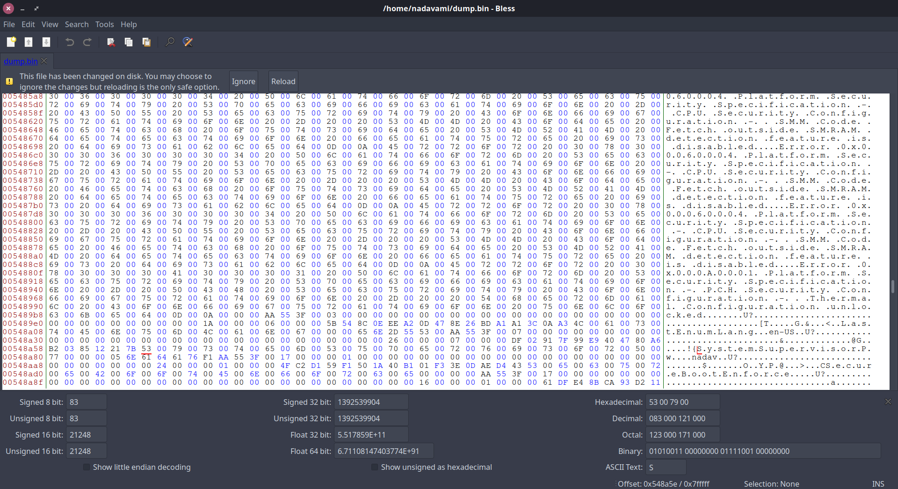

I have an old Linux laptop that I decided to repurpose last weekend. After spending 5 hours backing up files (APFS drive + read-only FUSE drivers + stubborn dev who doesn't want to think too hard (me) = slow backup using SCP), I was finally ready to install a fresh OS. I grab a USB drive, boot from it, and... the BIOS is password protected. Every password I try fails.

After some Googling, I found [this Github issue](https://github.com/Cr0wTom/Mi-Notebook-Pro-Mods/issues/6) discussing how to use Intel's FPTW64 tool to dump the BIOS and extract the password. Perfect! Except... version 11 of the tool is Windows-only, and my laptop is running Linux.

I've used `flashrom` in the past, an open-source tool for reading and writing flash chips, maybe it can be used here? A little more googling and turns out it can! The `-p internal` flag tells flashrom to use the laptop's own flash chip programmer instead of an external device.

The problem? Some memory regions are locked by default, which means flashrom complains and fails to read the entire chip, even the accessible regions. What to do?

First, I ran `flashrom` in verbose mode to see what memory regions were available:

```bash
flashrom -p internal -V
```

Buried in the output was this helpful information:

```
0x58: 0x07ff0200 FREG1: BIOS region (0x00200000-0x007fffff) is read-write.
0x5C: 0x01fe0001 FREG2: Management Engine region (0x00001000-0x001fefff) is locked.
0x64: 0x01ff01ff FREG4: Platform Data region (0x001ff000-0x001fffff) is locked.
Not all flash regions are freely accessible by flashrom. This is most likely
due to an active ME. Please see https://flashrom.org/ME for details.
```

Great! The BIOS region (`0x00200000-0x007fffff`) is accessible. I created a simple layout file to tell flashrom to only dump that region, it looks like this:

```
00200000:007fffff bios
```

Then ran the actual dump:

```bash
flashrom -p internal -l layout -i bios -r dump.bin
```

The `-l` flag points to the layout file, `-i bios` tells it to only read the "bios" region (the name is arbitrary but needs to match what's in the layout file), and `-r` writes it all to a file. A few seconds later, I had a BIOS dump.

Now I just needed to find the password in the hex dump. I knew from the Github issue that BIOS passwords are typically stored near a specific UTF-16 string: "SystemSupervisorPw" which in hex looks like:

```
00 53 00 79 00 73 00 74 00 65 00 6D 00 53 00 75 00 70 00 65 00 72 00 76 00 69 00 73 00 6F 00 72 00 50 00 77
```

I opened the dump in Bless (a hex editor) and searched for that sequence. Found it almost immediately. And right there, visible in the ASCII column, was the password.



So after approximately 8 hours of work and trying countless complex password combinations, the password was... `nadav`.

My name. All lowercase.

¯\\\_(ツ)\_/¯
